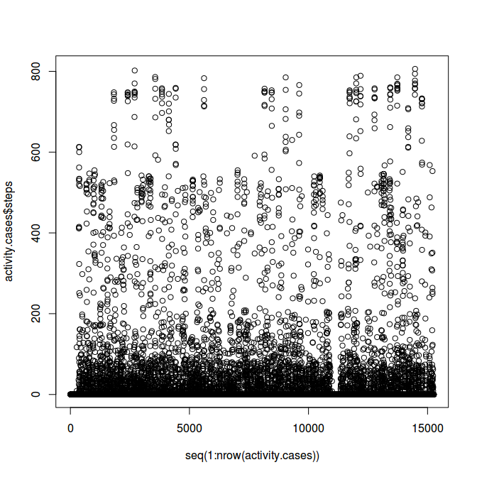
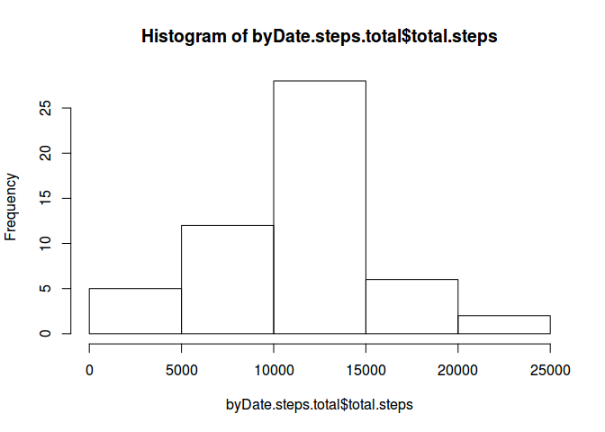
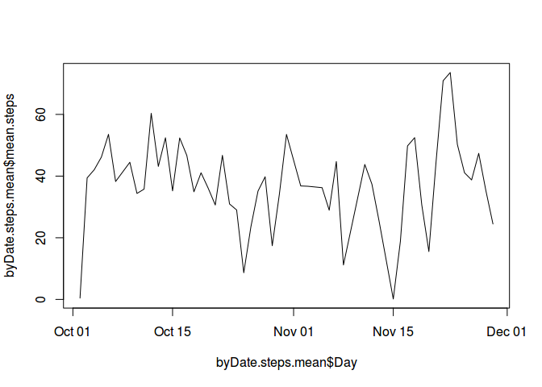
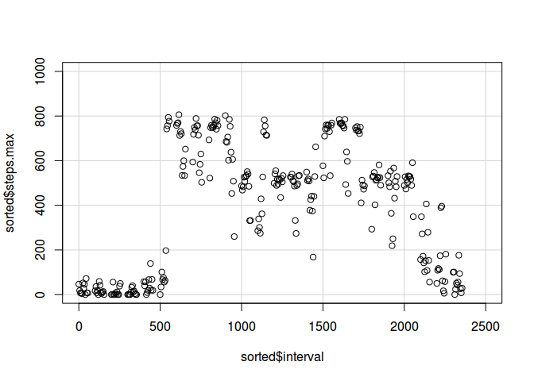
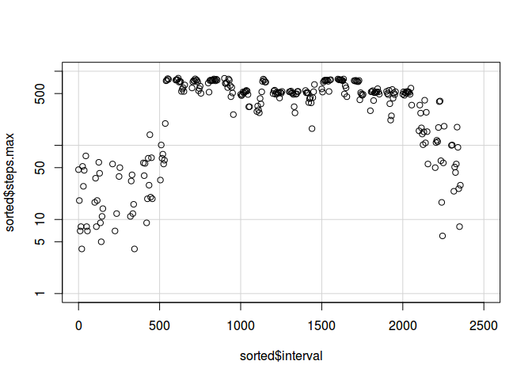
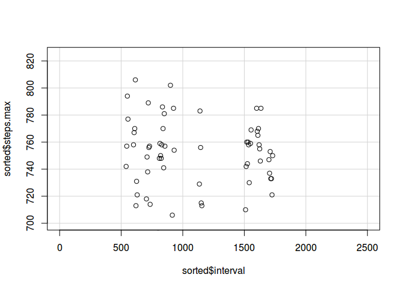
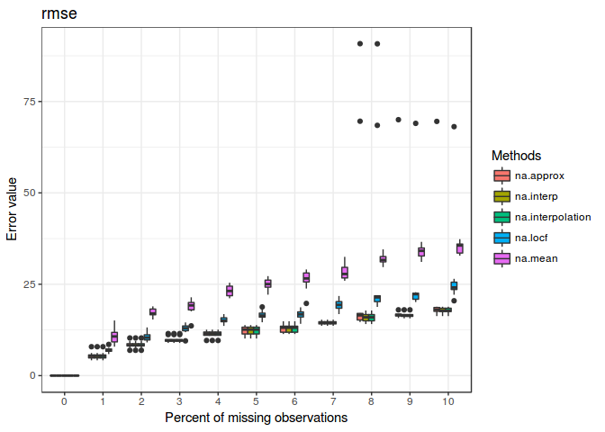
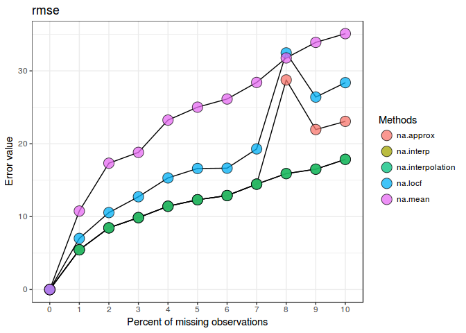
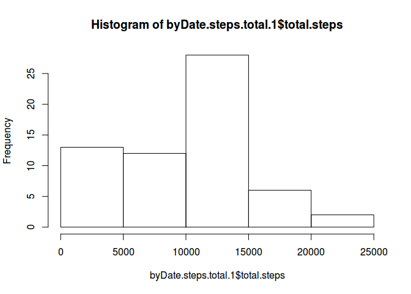
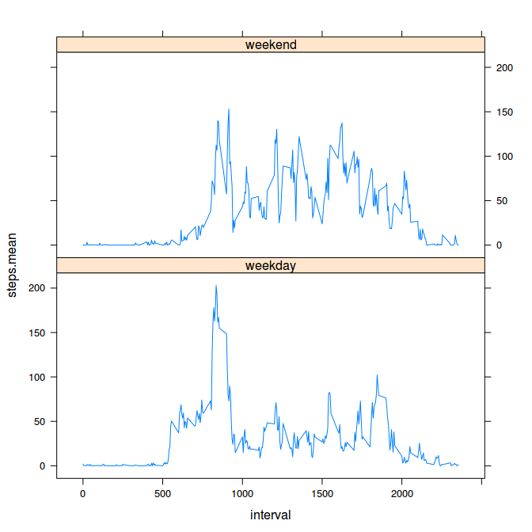

# Reproducible Research, Assignment 1
Alfonso R. Reyes  


## A. Loading and preprocessing the data
We start by downloading the raw data using the link provided by the instructor. We use a function that will download the zip file, unpack it and place it in an indicated directory. The function is called `downloadZip`.

### 1. Load the data

#### Downloading and unpacking raw data file


```r
library(RepDataPeerAssessment1)
library(rprojroot)

cat("Setting up the project folders:\n")
project.data <- find_package_root_file('data')
project.extdata <- find_package_root_file('inst/extdata')
project.R <- find_package_root_file('R')
project.data
project.R
project.extdata
```

```
Setting up the project folders:
[1] "/home/superuser/git.projects/RepDataPeerAssessment1/data"
[1] "/home/superuser/git.projects/RepDataPeerAssessment1/R"
[1] "/home/superuser/git.projects/RepDataPeerAssessment1/inst/extdata"
```


```r
downloadZip <- function(fileUrl, outDir="./data") {
  # function to download zipped file and unpack
  temp <- tempfile()
  download.file(fileUrl, temp, mode = "wb")
  unzip(temp, exdir = outDir)
}
```


```r
fileUrl <- "https://d396qusza40orc.cloudfront.net/repdata%2Fdata%2Factivity.zip"
cat("Unpacking the raw data file:\n")
```

```
Unpacking the raw data file:
```

```r
outDir <- project.extdata             # folder for raw data
downloadZip(fileUrl, outDir = outDir)   # download and unpack zip file
```
\    
     
#### Create the RData file
More RData files may be generated during this assignment. They will be placed under the folder `data`.


#### Saving the raw dataset to the `data` folder
Reads the CSV raw data file from `inst/extdata` and save it under `data`. Then remove it from memory.

```r
# save the dataset
activity.raw <- read.csv(paste(project.extdata, "activity.csv", sep = "/"))
save(activity.raw, file=paste(project.data, "activity.raw.RData", sep = "/"))
head(activity.raw)
```

```
  steps       date interval
1    NA 2012-10-01        0
2    NA 2012-10-01        5
3    NA 2012-10-01       10
4    NA 2012-10-01       15
5    NA 2012-10-01       20
6    NA 2012-10-01       25
```


**Convert the variable `date` from `as.factor` to `as.date`**

```r
activity <- activity.raw
activity$date <- as.Date(activity.raw$date)
str(activity) 
```

```
'data.frame':	17568 obs. of  3 variables:
 $ steps   : int  NA NA NA NA NA NA NA NA NA NA ...
 $ date    : Date, format: "2012-10-01" "2012-10-01" ...
 $ interval: int  0 5 10 15 20 25 30 35 40 45 ...
```


```r
# save the dataset
save(activity, file=paste(project.data, "activity.RData", sep = "/"))
head(activity)
```

```
  steps       date interval
1    NA 2012-10-01        0
2    NA 2012-10-01        5
3    NA 2012-10-01       10
4    NA 2012-10-01       15
5    NA 2012-10-01       20
6    NA 2012-10-01       25
```


Confirm it has been saved:

```r
rm(activity)                                            # remove variable from memory
load(paste(project.data, "activity.RData", sep = "/"))  # load data file
cat("Checking dataset has the structure we want\n\n")
str(activity)
head(activity)
# file.exists(paste(project.data, "activity.RData", sep = "/"))  # we could use this too
```

```
Checking dataset has the structure we want

'data.frame':	17568 obs. of  3 variables:
 $ steps   : int  NA NA NA NA NA NA NA NA NA NA ...
 $ date    : Date, format: "2012-10-01" "2012-10-01" ...
 $ interval: int  0 5 10 15 20 25 30 35 40 45 ...
  steps       date interval
1    NA 2012-10-01        0
2    NA 2012-10-01        5
3    NA 2012-10-01       10
4    NA 2012-10-01       15
5    NA 2012-10-01       20
6    NA 2012-10-01       25
```

\    

### 2. Process and transform
Process/transform the data (if necessary) into a format suitable for the analysis.

#### Basic sanity check

* Show first 6 rows of data frame
* Show dimensions of the data frame
* Show variable names
* Show summary


```r
library(RepDataPeerAssessment1)    #load my package

data("activity")
head(activity)
```

```
  steps       date interval
1    NA 2012-10-01        0
2    NA 2012-10-01        5
3    NA 2012-10-01       10
4    NA 2012-10-01       15
5    NA 2012-10-01       20
6    NA 2012-10-01       25
```


**<u>Show dimensions</u>**

```r
dim(activity)
```

```
[1] 17568     3
```

**<u>Names of the variables</u>**

```r
names(activity)
```

```
[1] "steps"    "date"     "interval"
```

**<u>Summary</u>**

```r
suma <- summary(activity)
suma
```

```
     steps             date               interval     
 Min.   :  0.00   Min.   :2012-10-01   Min.   :   0.0  
 1st Qu.:  0.00   1st Qu.:2012-10-16   1st Qu.: 588.8  
 Median :  0.00   Median :2012-10-31   Median :1177.5  
 Mean   : 37.38   Mean   :2012-10-31   Mean   :1177.5  
 3rd Qu.: 12.00   3rd Qu.:2012-11-15   3rd Qu.:1766.2  
 Max.   :806.00   Max.   :2012-11-30   Max.   :2355.0  
 NA's   :2304                                          
```

Notice that we have NA's   :2304  .

## B. What is the mean total number of steps taken per day?
We will ignore the NAs in this part of the assignment. 

### 1. Calculate the total number of steps taken per day


```r
# get only observations that are not NA
complete <- complete.cases(activity)
activity.cases <- activity[complete, ]
activity.NAs <- activity[!complete, ]       # NAs
activity.NAs.not <- activity.cases

cat("# of observations:\t", dim(activity.cases)[1], "\n")
cat("# of NAs:\t\t", dim(activity.NAs)[1], "\n")
```

```
# of observations:	 15264 
# of NAs:		 2304 
```


```r
plot(seq(1:nrow(activity.cases)), activity.cases$steps)
```

<!-- -->


#### Histogram of total number of steps each day


```r
byDate.steps.total <- aggregate(activity.cases$steps, 
                               by = list(activity.cases$date), sum)

# rename the variable to something meaningful
names(byDate.steps.total) <- c("Day", "total.steps")
# byDate.steps.total
hist(byDate.steps.total$total.steps)
```

<!-- -->


#### Find the **mean** and the **median** total number of steps per day


```r
mean.0 <- mean(byDate.steps.total$total.steps)
mean.0
```

```
[1] 10766.19
```


```r
median.0 <- median(byDate.steps.total$total.steps)
median.0
```

```
[1] 10765
```

#### How many unique intervals are there?
We want to know how many unique intervals there are because we will need later to calculate the maximum steps per interval and we need this number to verify our count of intervals is correct.


```r
unique(activity.cases$interval)
```

```
  [1]    0    5   10   15   20   25   30   35   40   45   50   55  100  105
 [15]  110  115  120  125  130  135  140  145  150  155  200  205  210  215
 [29]  220  225  230  235  240  245  250  255  300  305  310  315  320  325
 [43]  330  335  340  345  350  355  400  405  410  415  420  425  430  435
 [57]  440  445  450  455  500  505  510  515  520  525  530  535  540  545
 [71]  550  555  600  605  610  615  620  625  630  635  640  645  650  655
 [85]  700  705  710  715  720  725  730  735  740  745  750  755  800  805
 [99]  810  815  820  825  830  835  840  845  850  855  900  905  910  915
[113]  920  925  930  935  940  945  950  955 1000 1005 1010 1015 1020 1025
[127] 1030 1035 1040 1045 1050 1055 1100 1105 1110 1115 1120 1125 1130 1135
[141] 1140 1145 1150 1155 1200 1205 1210 1215 1220 1225 1230 1235 1240 1245
[155] 1250 1255 1300 1305 1310 1315 1320 1325 1330 1335 1340 1345 1350 1355
[169] 1400 1405 1410 1415 1420 1425 1430 1435 1440 1445 1450 1455 1500 1505
[183] 1510 1515 1520 1525 1530 1535 1540 1545 1550 1555 1600 1605 1610 1615
[197] 1620 1625 1630 1635 1640 1645 1650 1655 1700 1705 1710 1715 1720 1725
[211] 1730 1735 1740 1745 1750 1755 1800 1805 1810 1815 1820 1825 1830 1835
[225] 1840 1845 1850 1855 1900 1905 1910 1915 1920 1925 1930 1935 1940 1945
[239] 1950 1955 2000 2005 2010 2015 2020 2025 2030 2035 2040 2045 2050 2055
[253] 2100 2105 2110 2115 2120 2125 2130 2135 2140 2145 2150 2155 2200 2205
[267] 2210 2215 2220 2225 2230 2235 2240 2245 2250 2255 2300 2305 2310 2315
[281] 2320 2325 2330 2335 2340 2345 2350 2355
```
So, there are 288 **unique** intervals, with the first interval being 0 and the last 2355.

-----

## C. What is the average daily activity pattern?

### 1. Make a time series plot (i.e. type = "l") 
Make a time series plot (i.e. type = "l") of the 5-minute interval (x-axis) and the average number of steps taken, averaged across all days (y-axis)


```r
byDate.steps.mean <- aggregate(activity.cases$steps, 
                               by = list(activity.cases$date), mean)

# rename the variable to something meaningful
names(byDate.steps.mean) <- c("Day", "mean.steps")
plot(byDate.steps.mean$Day, byDate.steps.mean$mean.steps, type = "l")
```

<!-- -->

### 2. Which interval contain the maximum # of steps
Which 5-minute interval, on average across all the days in the dataset, contains the maximum number of steps?

#### Find day and interval with maximum number of steps

Let's find the maximum number of steps:

```r
max.steps <- max(activity.cases$steps)
max.steps
```

```
[1] 806
```

Now, let's find which interval holds the maximum number of steps:

```r
index <- which(activity.cases$steps == max.steps)
whole_row <- activity.cases[index, ]
whole_row
```

```
      steps       date interval
16492   806 2012-11-27      615
```

The interval with the maximum number of steps is 615.

**<u>Grouping by interval</u>**

```r
byInterval <- aggregate(activity.cases$steps, 
                        by = list(activity.cases$interval), 
                        max)

names(byInterval) <- c("interval", "steps.max")
sorted <- byInterval[order(-byInterval$steps.max), ]   # order by steps, descending
cat("These are the top 10 intervals with more activity\n\n")
head(sorted, 10)
```

```
These are the top 10 intervals with more activity

    interval steps.max
76       615       806
109      900       802
71       550       794
89       720       789
104      835       786
114      925       785
193     1600       785
200     1635       785
141     1140       783
107      850       781
```

\    

#### Find what are the intervals with more activity
We will plot the number maximum of steps in logarithmic scale:


```r
plot(sorted$interval, sorted$steps.max,
     xlim = c(0, 2500), ylim = range(1:1000),
     panel.first = grid(lty = 1))
```

<!-- -->


```r
plot(sorted$interval, sorted$steps.max, log = "y",
     xlim = c(0, 2500), ylim = range(1:1000),
     panel.first = grid(lty = 1))
```

```
Warning in xy.coords(x, y, xlabel, ylabel, log): 19 y values <= 0 omitted
from logarithmic plot
```

<!-- -->

And zooming in in a non-logarithmic plot, we can see that the maximum values are those around 800.

```r
# non-logarithmic plot
plot(sorted$interval, sorted$steps.max,
     xlim = range(0:2500), ylim = range(700:825),
     panel.first = grid(lty = 1))
```

<!-- -->

What we can confirm is that the maximum activity occurs between the **500 and 2000** intervals.


## D. Imputing missing values

### 1. Calculate the number of missing values
Calculate and report the total number of missing values in the dataset (i.e. the total number of rows with NAs)


```r
# get only observations that are  NA
complete <- complete.cases(activity)
activity.missing <- activity[!complete, ]
nrow(activity.missing)
```

```
[1] 2304
```

### 2. Complete missing values
Devise a strategy for filling in all of the missing values in the dataset. The strategy does not need to be sophisticated. For example, you could use the mean/median for that day, or the mean for that 5-minute interval, etc.

There are several ways we can complete the missing values and lots of R packages available to perform the imputation. We will make it the easier way. This is the strategy:

<u>Motivation</u>

Since there is no way to compare in a dataset with missing values how a imputation method performs, after several attempts on resolving this, I found in the literature that the imputation method selection is done based on a dataset without any missing values first. 

1. Using the dataset under analysis, we proceed to generate a new one but without any missing values.

2. We apply several imputation methods on the new dataset but this time the missing values are entered under control, the amount and randomness which could be MCAR or MAR, among several others.

3. The result of applying these methods will give us a performance plot of the methods used versus the Root Mean Squared Error (RMSE). We will chose the imputation method with the lowest RMSE.

4. After selecting the imputation method, we go back to our original dataset with missing data and apply the imputation method with the best performance, as selected above.

5. The result will be the data frame with imputed data.

Since this topic needs not to be sophisticated at this stage, we will use a pretty straight forward R package called `imputTestbench`. It is available in CRAN. We will describe the steps in detail below.

#### 2.1. Generate a new dataset but without missing values

```r
ok <- complete.cases(activity$steps)
steps.clean <- activity$steps[ok]
length(steps.clean)
```

```
[1] 15264
```

#### 2.2. Apply several imputation methods


```r
library(imputeTestbench)

itb <- impute_errors(steps.clean, 
                     missPercentFrom = 0, missPercentTo = 10, 
                     interval = 1, blckper = TRUE, blck = 10)
```

```
Warning in obs - pred: longer object length is not a multiple of shorter
object length

Warning in obs - pred: longer object length is not a multiple of shorter
object length

Warning in obs - pred: longer object length is not a multiple of shorter
object length

Warning in obs - pred: longer object length is not a multiple of shorter
object length

Warning in obs - pred: longer object length is not a multiple of shorter
object length

Warning in obs - pred: longer object length is not a multiple of shorter
object length

Warning in obs - pred: longer object length is not a multiple of shorter
object length

Warning in obs - pred: longer object length is not a multiple of shorter
object length

Warning in obs - pred: longer object length is not a multiple of shorter
object length

Warning in obs - pred: longer object length is not a multiple of shorter
object length

Warning in obs - pred: longer object length is not a multiple of shorter
object length

Warning in obs - pred: longer object length is not a multiple of shorter
object length
```

```r
itb
```

```
$Parameter
[1] "rmse"

$MissingPercent
 [1]  0  1  2  3  4  5  6  7  8  9 10

$na.approx
 [1]  0.000000  5.454556  8.464277  9.868567 11.428547 12.319045 12.893618
 [8] 14.459085 28.757653 21.950026 23.074516

$na.interp
 [1]  0.000000  5.454556  8.464277  9.868567 11.428547 12.319045 12.893618
 [8] 14.459085 15.907699 16.514481 17.861687

$na.interpolation
 [1]  0.000000  5.454556  8.464277  9.868567 11.428547 12.319045 12.893618
 [8] 14.459085 15.907699 16.514481 17.861687

$na.locf
 [1]  0.000000  7.017167 10.559172 12.729527 15.313857 16.609814 16.649949
 [8] 19.293431 32.467342 26.404211 28.383793

$na.mean
 [1]  0.00000 10.77232 17.33313 18.81955 23.24894 25.02165 26.14002
 [8] 28.41363 31.77541 33.91116 35.10665
```

#### 2.3. Performance plots


```r
plot_errors(itb)
```

<!-- -->

From the boxplot we can see that the methods with the lowest error are `na.interp` and `na.interpolation`. These two methods are included in the package _______. We will be able to see this clearly with the line type plot:


```r
plot_errors(dataIn = itb, plotType = "line")
```

<!-- -->

Both interpolation methods are overlapping which means that there is not significant difference between applying any of them. Also we can see that the worst performing imputing methods are the Last Observation Carried Forward (LOCF) and the mean.

This how it looks four of the different imputation simulations at 10% missing data rate.


```r
plot_impute(steps.clean, 
            methods = c("na.mean", "na.locf", "na.interp"), 
            missPercent = 10) 
```

<!-- -->

#### 2.4. Apply selected imputation method to the original dataset
We bring up the original data frame and get the vectors for the `steps` variable.

The function used is na.interp from the package 'forecast'. So, the imputation will be performed with `na.interp`.


```r
library(forecast)

steps <- activity$steps

summary(activity$steps)
```

```
   Min. 1st Qu.  Median    Mean 3rd Qu.    Max.    NA's 
   0.00    0.00    0.00   37.38   12.00  806.00    2304 
```

```r
se.0 <- sd(activity$steps, 
           na.rm = TRUE) / sqrt(sum(!is.na(activity$steps)))
cat("SE(before imp.) = ", se.0, "\n\n")
```

```
SE(before imp.) =  0.9064973 
```

```r
steps.imp.interp <- na.interp(steps)     # interpolating the NA values

summary(steps.imp.interp)
```

```
   Min. 1st Qu.  Median    Mean 3rd Qu.    Max. 
   0.00    0.00    0.00   32.48    0.00  806.00 
```

```r
se.1 <- sd(steps.imp.interp, 
           na.rm = TRUE) / sqrt(sum(!is.na(steps.imp.interp)))
cat("SE(after imp.) = ", se.1, "\n")
```

```
SE(after imp.) =  0.7933427 
```

What we can see is that there is an improvement in the Standard Error (SE) from 0.91 to 0.79.

\     

### 4. Make a histogram (with missing data filled in)
Make a histogram of the total number of steps taken each day and Calculate and report the mean and median total number of steps taken per day. Do these values differ from the estimates from the first part of the assignment? What is the impact of imputing missing data on the estimates of the total daily number of steps?

First, we put together the activity data frame with the imputed values.


```r
activity.imp <- activity

activity.imp$steps <- as.numeric(steps.imp.interp)

summary(activity.imp)
```

```
     steps             date               interval     
 Min.   :  0.00   Min.   :2012-10-01   Min.   :   0.0  
 1st Qu.:  0.00   1st Qu.:2012-10-16   1st Qu.: 588.8  
 Median :  0.00   Median :2012-10-31   Median :1177.5  
 Mean   : 32.48   Mean   :2012-10-31   Mean   :1177.5  
 3rd Qu.:  0.00   3rd Qu.:2012-11-15   3rd Qu.:1766.2  
 Max.   :806.00   Max.   :2012-11-30   Max.   :2355.0  
```

```r
str(activity.imp)
```

```
'data.frame':	17568 obs. of  3 variables:
 $ steps   : num  0 0 0 0 0 0 0 0 0 0 ...
 $ date    : Date, format: "2012-10-01" "2012-10-01" ...
 $ interval: int  0 5 10 15 20 25 30 35 40 45 ...
```


```r
byDate.steps.total.1 <- aggregate(activity.imp$steps, 
                               by = list(activity.imp$date), sum)

# rename the variable to something meaningful
names(byDate.steps.total.1) <- c("Day", "total.steps")
summary(byDate.steps.total.1$total.steps)
```

```
   Min. 1st Qu.  Median    Mean 3rd Qu.    Max. 
      0    6778   10400    9354   12810   21190 
```

```r
hist(byDate.steps.total.1$total.steps)
```

<!-- -->

Calculating the mean and the media for the imputed `steps`

```r
mean.1 <- mean(byDate.steps.total.1$total.steps)
median.1 <- median(byDate.steps.total.1$total.steps)
mean.1
```

```
[1] 9354.23
```

```r
median.1
```

```
[1] 10395
```

And we find that there is a difference between mean and the media with the dataset with missing data and the dataset with imputed values.


```r
mean.0 - mean.1
```

```
[1] 1411.959
```

```r
median.0 - median.1
```

```
[1] 370
```

The change in the mean is 13 percent and of the median is 3 percent.

\   


## E. Are there differences in activity patterns between weekdays and weekends?

### 1. Create a new factor variable
Create a new factor variable in the dataset with two levels – “weekday” and “weekend” indicating whether a given date is a weekday or weekend day.


```r
activity.imp$week <- ifelse(weekdays(activity.imp$date) %in% c("Saturday", "Sunday"), "weekend", "weekday")

# View(activity.imp)

activity.imp$week <- as.factor(activity.imp$week)
str(activity.imp)
```

```
'data.frame':	17568 obs. of  4 variables:
 $ steps   : num  0 0 0 0 0 0 0 0 0 0 ...
 $ date    : Date, format: "2012-10-01" "2012-10-01" ...
 $ interval: int  0 5 10 15 20 25 30 35 40 45 ...
 $ week    : Factor w/ 2 levels "weekday","weekend": 1 1 1 1 1 1 1 1 1 1 ...
```


### 2. Make a panel
Make a panel plot containing a time series plot (i.e. type = "l") of the 5-minute interval (x-axis) and the average number of steps taken, averaged across all weekday days or weekend days (y-axis). See the README file in the GitHub repository to see an example of what this plot should look like using simulated data.


```r
activity.imp.1 <- activity.imp

byInterval <- aggregate(activity.imp.1$steps, 
                        by = list(activity.imp.1$interval, activity.imp.1$week), mean)

names(byInterval) <- c("interval", "week", "steps.mean")
byInterval
```

```
    interval    week   steps.mean
1          0 weekday   2.02222222
2          5 weekday   0.40000000
3         10 weekday   0.15555556
4         15 weekday   0.17777778
5         20 weekday   0.08888889
6         25 weekday   1.31111111
7         30 weekday   0.62222222
8         35 weekday   1.02222222
9         40 weekday   0.00000000
10        45 weekday   1.60000000
11        50 weekday   0.35555556
12        55 weekday   0.00000000
13       100 weekday   0.37777778
14       105 weekday   0.00000000
15       110 weekday   0.17777778
16       115 weekday   0.40000000
17       120 weekday   0.00000000
18       125 weekday   1.31111111
19       130 weekday   1.97777778
20       135 weekday   0.00000000
21       140 weekday   0.20000000
22       145 weekday   0.20000000
23       150 weekday   0.31111111
24       155 weekday   0.00000000
25       200 weekday   0.00000000
26       205 weekday   0.00000000
27       210 weekday   1.24444444
28       215 weekday   0.00000000
29       220 weekday   0.00000000
30       225 weekday   0.15555556
31       230 weekday   0.00000000
32       235 weekday   0.26666667
33       240 weekday   0.00000000
34       245 weekday   0.00000000
35       250 weekday   1.82222222
36       255 weekday   1.11111111
37       300 weekday   0.00000000
38       305 weekday   0.00000000
39       310 weekday   0.00000000
40       315 weekday   0.00000000
41       320 weekday   0.00000000
42       325 weekday   0.73333333
43       330 weekday   1.02222222
44       335 weekday   0.44444444
45       340 weekday   0.35555556
46       345 weekday   0.08888889
47       350 weekday   0.00000000
48       355 weekday   0.00000000
49       400 weekday   0.11111111
50       405 weekday   1.11111111
51       410 weekday   1.88888889
52       415 weekday   0.00000000
53       420 weekday   0.40000000
54       425 weekday   0.00000000
55       430 weekday   2.82222222
56       435 weekday   0.13333333
57       440 weekday   3.31111111
58       445 weekday   0.77777778
59       450 weekday   1.93333333
60       455 weekday   0.57777778
61       500 weekday   0.00000000
62       505 weekday   1.84444444
63       510 weekday   3.53333333
64       515 weekday   1.88888889
65       520 weekday   3.77777778
66       525 weekday   2.31111111
67       530 weekday   2.46666667
68       535 weekday   7.13333333
69       540 weekday  18.26666667
70       545 weekday  21.20000000
71       550 weekday  45.08888889
72       555 weekday  50.33333333
73       600 weekday  37.08888889
74       605 weekday  58.02222222
75       610 weekday  62.91111111
76       615 weekday  68.68888889
77       620 weekday  57.26666667
78       625 weekday  53.75555556
79       630 weekday  59.48888889
80       635 weekday  42.73333333
81       640 weekday  49.80000000
82       645 weekday  48.97777778
83       650 weekday  42.06666667
84       655 weekday  53.88888889
85       700 weekday  44.75555556
86       705 weekday  44.91111111
87       710 weekday  55.28888889
88       715 weekday  62.06666667
89       720 weekday  56.44444444
90       725 weekday  52.31111111
91       730 weekday  58.80000000
92       735 weekday  48.44444444
93       740 weekday  55.75555556
94       745 weekday  74.11111111
95       750 weekday  60.02222222
96       755 weekday  59.08888889
97       800 weekday  72.93333333
98       805 weekday  62.86666667
99       810 weekday 126.75555556
100      815 weekday 160.97777778
101      820 weekday 177.75555556
102      825 weekday 162.88888889
103      830 weekday 175.24444444
104      835 weekday 202.88888889
105      840 weekday 192.77777778
106      845 weekday 161.71111111
107      850 weekday 166.77777778
108      855 weekday 154.82222222
109      900 weekday 148.53333333
110      905 weekday 109.24444444
111      910 weekday  79.40000000
112      915 weekday  72.88888889
113      920 weekday  89.71111111
114      925 weekday  79.66666667
115      930 weekday  49.68888889
116      935 weekday  29.82222222
117      940 weekday  24.15555556
118      945 weekday  35.68888889
119      950 weekday  34.46666667
120      955 weekday  14.82222222
121     1000 weekday  32.46666667
122     1005 weekday  14.62222222
123     1010 weekday  33.42222222
124     1015 weekday  40.80000000
125     1020 weekday  25.15555556
126     1025 weekday  28.37777778
127     1030 weekday  27.22222222
128     1035 weekday  19.26666667
129     1040 weekday  18.88888889
130     1045 weekday  22.13333333
131     1050 weekday  18.68888889
132     1055 weekday  19.00000000
133     1100 weekday  17.51111111
134     1105 weekday  21.13333333
135     1110 weekday   8.84444444
136     1115 weekday  12.86666667
137     1120 weekday  20.40000000
138     1125 weekday  20.20000000
139     1130 weekday  28.31111111
140     1135 weekday  43.53333333
141     1140 weekday  38.95555556
142     1145 weekday  41.97777778
143     1150 weekday  43.97777778
144     1155 weekday  48.24444444
145     1200 weekday  47.20000000
146     1205 weekday  61.15555556
147     1210 weekday  71.00000000
148     1215 weekday  62.91111111
149     1220 weekday  40.26666667
150     1225 weekday  40.13333333
151     1230 weekday  55.31111111
152     1235 weekday  26.42222222
153     1240 weekday  18.44444444
154     1245 weekday  24.28888889
155     1250 weekday  26.77777778
156     1255 weekday  47.62222222
157     1300 weekday  18.95555556
158     1305 weekday  20.42222222
159     1310 weekday  18.80000000
160     1315 weekday  10.17777778
161     1320 weekday  29.46666667
162     1325 weekday  37.33333333
163     1330 weekday  26.06666667
164     1335 weekday  19.95555556
165     1340 weekday  19.91111111
166     1345 weekday  33.04444444
167     1350 weekday  19.26666667
168     1355 weekday  28.22222222
169     1400 weekday  39.48888889
170     1405 weekday  32.62222222
171     1410 weekday  26.31111111
172     1415 weekday  38.55555556
173     1420 weekday  22.75555556
174     1425 weekday  25.75555556
175     1430 weekday  25.91111111
176     1435 weekday  10.84444444
177     1440 weekday   9.26666667
178     1445 weekday  18.51111111
179     1450 weekday  36.04444444
180     1455 weekday  32.44444444
181     1500 weekday  26.86666667
182     1505 weekday  30.24444444
183     1510 weekday  25.22222222
184     1515 weekday  26.73333333
185     1520 weekday  33.73333333
186     1525 weekday  30.97777778
187     1530 weekday  35.71111111
188     1535 weekday  42.22222222
189     1540 weekday  79.51111111
190     1545 weekday  82.71111111
191     1550 weekday  80.33333333
192     1555 weekday  59.11111111
193     1600 weekday  38.60000000
194     1605 weekday  36.64444444
195     1610 weekday  46.66666667
196     1615 weekday  27.71111111
197     1620 weekday  19.22222222
198     1625 weekday  21.55555556
199     1630 weekday  16.66666667
200     1635 weekday  16.68888889
201     1640 weekday  19.91111111
202     1645 weekday  25.93333333
203     1650 weekday  21.46666667
204     1655 weekday  26.60000000
205     1700 weekday  17.35555556
206     1705 weekday  37.44444444
207     1710 weekday  27.42222222
208     1715 weekday  39.91111111
209     1720 weekday  50.42222222
210     1725 weekday  61.84444444
211     1730 weekday  46.95555556
212     1735 weekday  57.86666667
213     1740 weekday  72.86666667
214     1745 weekday  51.80000000
215     1750 weekday  29.86666667
216     1755 weekday  32.60000000
217     1800 weekday  21.22222222
218     1805 weekday  38.88888889
219     1810 weekday  57.26666667
220     1815 weekday  71.26666667
221     1820 weekday  53.48888889
222     1825 weekday  64.42222222
223     1830 weekday  68.86666667
224     1835 weekday  71.60000000
225     1840 weekday  80.33333333
226     1845 weekday 102.20000000
227     1850 weekday  89.75555556
228     1855 weekday  79.17777778
229     1900 weekday  76.24444444
230     1905 weekday  66.84444444
231     1910 weekday  54.64444444
232     1915 weekday  47.26666667
233     1920 weekday  33.04444444
234     1925 weekday  17.80000000
235     1930 weekday  25.44444444
236     1935 weekday  40.64444444
237     1940 weekday  26.02222222
238     1945 weekday  15.17777778
239     1950 weekday  38.17777778
240     1955 weekday  22.82222222
241     2000 weekday  10.77777778
242     2005 weekday   3.02222222
243     2010 weekday   4.24444444
244     2015 weekday   9.66666667
245     2020 weekday   5.13333333
246     2025 weekday   2.88888889
247     2030 weekday   6.13333333
248     2035 weekday   4.31111111
249     2040 weekday   6.35555556
250     2045 weekday  10.26666667
251     2050 weekday  21.66666667
252     2055 weekday  14.62222222
253     2100 weekday   9.24444444
254     2105 weekday  16.60000000
255     2110 weekday  25.37777778
256     2115 weekday  16.37777778
257     2120 weekday  12.62222222
258     2125 weekday   6.97777778
259     2130 weekday  10.84444444
260     2135 weekday  14.33333333
261     2140 weekday   5.97777778
262     2145 weekday   6.55555556
263     2150 weekday   7.17777778
264     2155 weekday   3.08888889
265     2200 weekday   1.33333333
266     2205 weekday   3.93333333
267     2210 weekday   5.66666667
268     2215 weekday  10.02222222
269     2220 weekday   8.33333333
270     2225 weekday   9.68888889
271     2230 weekday  11.48888889
272     2235 weekday   2.60000000
273     2240 weekday   0.00000000
274     2245 weekday   0.13333333
275     2250 weekday   1.68888889
276     2255 weekday   1.40000000
277     2300 weekday   3.11111111
278     2305 weekday   3.35555556
279     2310 weekday   0.00000000
280     2315 weekday   0.97777778
281     2320 weekday   1.13333333
282     2325 weekday   1.66666667
283     2330 weekday   2.68888889
284     2335 weekday   1.62222222
285     2340 weekday   1.80000000
286     2345 weekday   0.17777778
287     2350 weekday   0.26666667
288     2355 weekday   1.26666667
289        0 weekend   0.00000000
290        5 weekend   0.00000000
291       10 weekend   0.00000000
292       15 weekend   0.00000000
293       20 weekend   0.00000000
294       25 weekend   3.25000000
295       30 weekend   0.00000000
296       35 weekend   0.00000000
297       40 weekend   0.00000000
298       45 weekend   0.37500000
299       50 weekend   0.00000000
300       55 weekend   0.43750000
301      100 weekend   0.00000000
302      105 weekend   2.25000000
303      110 weekend   0.00000000
304      115 weekend   0.00000000
305      120 weekend   0.00000000
306      125 weekend   0.00000000
307      130 weekend   0.50000000
308      135 weekend   0.56250000
309      140 weekend   0.00000000
310      145 weekend   0.68750000
311      150 weekend   0.00000000
312      155 weekend   0.00000000
313      200 weekend   0.00000000
314      205 weekend   0.00000000
315      210 weekend   0.25000000
316      215 weekend   0.00000000
317      220 weekend   0.00000000
318      225 weekend   0.00000000
319      230 weekend   0.00000000
320      235 weekend   0.00000000
321      240 weekend   0.00000000
322      245 weekend   0.00000000
323      250 weekend   0.00000000
324      255 weekend   0.00000000
325      300 weekend   0.00000000
326      305 weekend   0.00000000
327      310 weekend   0.00000000
328      315 weekend   0.00000000
329      320 weekend   0.68750000
330      325 weekend   0.00000000
331      330 weekend   2.50000000
332      335 weekend   0.68750000
333      340 weekend   0.62500000
334      345 weekend   0.00000000
335      350 weekend   0.00000000
336      355 weekend   0.00000000
337      400 weekend   3.62500000
338      405 weekend   0.00000000
339      410 weekend   3.18750000
340      415 weekend   0.00000000
341      420 weekend   0.00000000
342      425 weekend   1.18750000
343      430 weekend   5.68750000
344      435 weekend   1.81250000
345      440 weekend   2.25000000
346      445 weekend   0.56250000
347      450 weekend   4.87500000
348      455 weekend   2.06250000
349      500 weekend   0.00000000
350      505 weekend   0.00000000
351      510 weekend   0.00000000
352      515 weekend   2.12500000
353      520 weekend   0.37500000
354      525 weekend   3.31250000
355      530 weekend   0.00000000
356      535 weekend   0.00000000
357      540 weekend   1.68750000
358      545 weekend   1.12500000
359      550 weekend   3.87500000
360      555 weekend   5.81250000
361      600 weekend   0.00000000
362      605 weekend   0.00000000
363      610 weekend   1.18750000
364      615 weekend  17.00000000
365      620 weekend   4.43750000
366      625 weekend   4.75000000
367      630 weekend   5.43750000
368      635 weekend  10.12500000
369      640 weekend   5.75000000
370      645 weekend   8.56250000
371      650 weekend   5.43750000
372      655 weekend  10.87500000
373      700 weekend  19.25000000
374      705 weekend  20.68750000
375      710 weekend  11.81250000
376      715 weekend   6.00000000
377      720 weekend   6.62500000
378      725 weekend  21.75000000
379      730 weekend  19.06250000
380      735 weekend  10.56250000
381      740 weekend  16.31250000
382      745 weekend  21.93750000
383      750 weekend  22.81250000
384      755 weekend  19.81250000
385      800 weekend  37.93750000
386      805 weekend  49.12500000
387      810 weekend  72.25000000
388      815 weekend  69.06250000
389      820 weekend  67.00000000
390      825 weekend  56.62500000
391      830 weekend  94.43750000
392      835 weekend 112.31250000
393      840 weekend 106.81250000
394      845 weekend 140.00000000
395      850 weekend 138.43750000
396      855 weekend 117.81250000
397      900 weekend  57.43750000
398      905 weekend 103.62500000
399      910 weekend 138.12500000
400      915 weekend 153.12500000
401      920 weekend  91.25000000
402      925 weekend  93.81250000
403      930 weekend  79.56250000
404      935 weekend  65.93750000
405      940 weekend  14.18750000
406      945 weekend  28.00000000
407      950 weekend  18.93750000
408      955 weekend  28.06250000
409     1000 weekend  43.06250000
410     1005 weekend  48.25000000
411     1010 weekend  46.50000000
412     1015 weekend  59.68750000
413     1020 weekend  58.18750000
414     1025 weekend  88.43750000
415     1030 weekend  70.12500000
416     1035 weekend  69.75000000
417     1040 weekend  61.81250000
418     1045 weekend  31.62500000
419     1050 weekend  30.56250000
420     1055 weekend  52.37500000
421     1100 weekend  54.62500000
422     1105 weekend  38.87500000
423     1110 weekend  45.75000000
424     1115 weekend  48.43750000
425     1120 weekend  36.62500000
426     1125 weekend  30.87500000
427     1130 weekend  31.12500000
428     1135 weekend  43.12500000
429     1140 weekend  29.68750000
430     1145 weekend  29.68750000
431     1150 weekend  28.81250000
432     1155 weekend  60.37500000
433     1200 weekend  78.81250000
434     1205 weekend 118.50000000
435     1210 weekend 114.50000000
436     1215 weekend 130.37500000
437     1220 weekend  96.75000000
438     1225 weekend  53.31250000
439     1230 weekend  24.87500000
440     1235 weekend  33.06250000
441     1240 weekend  36.00000000
442     1245 weekend  56.68750000
443     1250 weekend  73.93750000
444     1255 weekend  88.93750000
445     1300 weekend  86.93750000
446     1305 weekend  74.68750000
447     1310 weekend  90.43750000
448     1315 weekend 107.12500000
449     1320 weekend  70.31250000
450     1325 weekend  81.93750000
451     1330 weekend  68.31250000
452     1335 weekend  27.12500000
453     1340 weekend  76.37500000
454     1345 weekend  84.43750000
455     1350 weekend 102.56250000
456     1355 weekend 122.06250000
457     1400 weekend  73.62500000
458     1405 weekend  80.37500000
459     1410 weekend  70.37500000
460     1415 weekend  52.87500000
461     1420 weekend  53.50000000
462     1425 weekend  51.93750000
463     1430 weekend  65.75000000
464     1435 weekend  60.62500000
465     1440 weekend  30.62500000
466     1445 weekend  34.31250000
467     1450 weekend  43.12500000
468     1455 weekend  53.75000000
469     1500 weekend  23.87500000
470     1505 weekend  34.43750000
471     1510 weekend  46.62500000
472     1515 weekend  53.50000000
473     1520 weekend  57.37500000
474     1525 weekend  71.06250000
475     1530 weekend  59.00000000
476     1535 weekend  97.62500000
477     1540 weekend  51.00000000
478     1545 weekend  94.18750000
479     1550 weekend 112.31250000
480     1555 weekend 111.87500000
481     1600 weekend  97.25000000
482     1605 weekend 109.37500000
483     1610 weekend 115.68750000
484     1615 weekend 131.31250000
485     1620 weekend 134.43750000
486     1625 weekend 137.37500000
487     1630 weekend  98.43750000
488     1635 weekend  80.81250000
489     1640 weekend  91.93750000
490     1645 weekend  77.62500000
491     1650 weekend  92.68750000
492     1655 weekend  69.87500000
493     1700 weekend 105.62500000
494     1705 weekend  81.18750000
495     1710 weekend  90.87500000
496     1715 weekend  90.56250000
497     1720 weekend  99.06250000
498     1725 weekend  87.56250000
499     1730 weekend  96.31250000
500     1735 weekend  34.87500000
501     1740 weekend  43.81250000
502     1745 weekend  41.50000000
503     1750 weekend  31.18750000
504     1755 weekend  32.37500000
505     1800 weekend  75.06250000
506     1805 weekend  82.81250000
507     1810 weekend  86.37500000
508     1815 weekend  82.18750000
509     1820 weekend  45.87500000
510     1825 weekend  43.31250000
511     1830 weekend  63.68750000
512     1835 weekend  44.56250000
513     1840 weekend  56.75000000
514     1845 weekend  42.00000000
515     1850 weekend  34.37500000
516     1855 weekend  60.87500000
517     1900 weekend  66.68750000
518     1905 weekend  69.81250000
519     1910 weekend  38.56250000
520     1915 weekend  43.81250000
521     1920 weekend  27.37500000
522     1925 weekend  18.56250000
523     1930 weekend  19.18750000
524     1935 weekend  18.25000000
525     1940 weekend  26.87500000
526     1945 weekend  41.93750000
527     1950 weekend  43.87500000
528     1955 weekend  46.87500000
529     2000 weekend  34.68750000
530     2005 weekend  54.50000000
531     2010 weekend  52.12500000
532     2015 weekend  83.25000000
533     2020 weekend  74.37500000
534     2025 weekend  62.00000000
535     2030 weekend  73.18750000
536     2035 weekend  58.56250000
537     2040 weekend  46.87500000
538     2045 weekend  41.75000000
539     2050 weekend  46.06250000
540     2055 weekend  25.62500000
541     2100 weekend  26.81250000
542     2105 weekend  10.37500000
543     2110 weekend   6.31250000
544     2115 weekend  17.68750000
545     2120 weekend   5.75000000
546     2125 weekend   6.93750000
547     2130 weekend  18.06250000
548     2135 weekend  13.68750000
549     2140 weekend  11.93750000
550     2145 weekend   7.37500000
551     2150 weekend   6.75000000
552     2155 weekend   0.00000000
553     2200 weekend   1.06250000
554     2205 weekend   1.12500000
555     2210 weekend   0.00000000
556     2215 weekend   0.00000000
557     2220 weekend   0.00000000
558     2225 weekend   1.56250000
559     2230 weekend   0.00000000
560     2235 weekend   0.00000000
561     2240 weekend   1.06250000
562     2245 weekend   0.00000000
563     2250 weekend   0.56250000
564     2255 weekend  11.31250000
565     2300 weekend   2.18750000
566     2305 weekend   0.00000000
567     2310 weekend   0.00000000
568     2315 weekend   0.00000000
569     2320 weekend   0.00000000
570     2325 weekend   0.56250000
571     2330 weekend   1.06250000
572     2335 weekend  11.00000000
573     2340 weekend   5.87500000
574     2345 weekend   1.62500000
575     2350 weekend   0.00000000
576     2355 weekend   0.00000000
```


```r
library(lattice)
# xyplot(y ~ x | panel, data = dataset, type = "o")
xyplot(steps.mean ~ interval | as.factor(week), 
       data = byInterval, 
       type = "l", 
       layout=c(1,2))
```

<!-- -->


